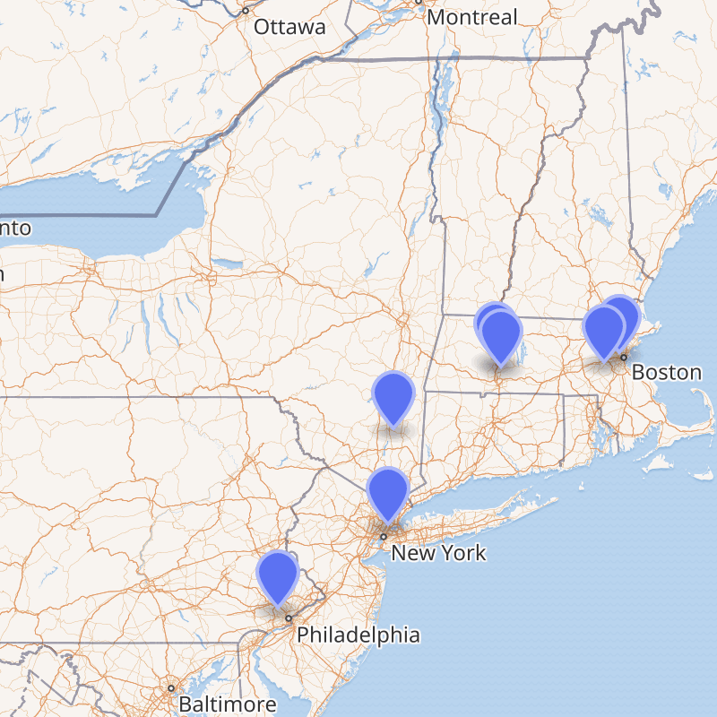

The "Seven Sisters" is a group of seven historic women's liberal arts colleges in the New England area. The name is a reference to the mythological Pleiades sisters, who were companions of Artemis and later immortalized as a cluster of stars in the night sky. The association formalized in 1926 with the main goal of addressing inequalities with men's colleges and raising endowments to offer competitive pay to faculty. Today, the Sisters remain an ongoing collaborative effort even as some of the "sisters" are no longer women-only; their main goal is now a shared commitment to diversity and equity.

Learn more about the sisters \[would link to their pages\]:

Barnard College

Bryn Mawr College

Mount Holyoke College

Smith College

Wellsley College

Vassar College

Radcliffe College

\[ideally insert map here\] (this map is from wikipedia but i'd like to make my own)

{fig-align="center"}
